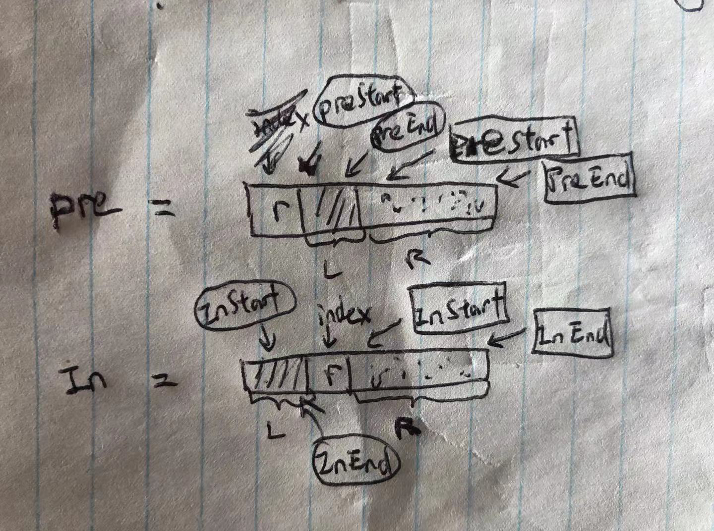

### 递归

总的来看，是树的前序遍历   

难点在于，确定左右子树的边界  

  

```py
# Definition for a binary tree node.
# class TreeNode:
#     def __init__(self, x):
#         self.val = x
#         self.left = None
#         self.right = None

class Solution:
    def buildTree(self, preorder: List[int], inorder: List[int]) -> TreeNode:

        return self.buildTreeHelper(preorder, 0, len(preorder) - 1, inorder, 0, len(inorder) - 1)

    def buildTreeHelper(self, preorder, preStart, preEnd, inorder, inorderStart, inorderEnd):
        if preStart > preEnd:
            return 

        root = TreeNode(preorder[preStart])

        index = inorder.index(preorder[preStart])
        leftTreeLen = index - inorderStart

        # build left subtree
        root.left = self.buildTreeHelper(preorder, preStart + 1, preStart + leftTreeLen, inorder, inorderStart, index - 1)

        # build right subtree
        root.right = self.buildTreeHelper(preorder, preStart + leftTreeLen + 1, preEnd, inorder, index + 1, inorderEnd)


        return root
```
