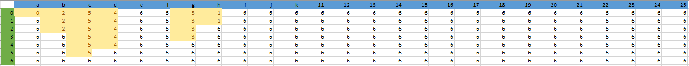

### 双指针
O(len(s) + len(t)) time, O(1) space
```py
class Solution:
    def isSubsequence(self, s: str, t: str) -> bool:

        # find s[s_i] in t,
        # if s_i reach the end.return true
        # if t_i reach the end, return false

        if not s:
            return True

        s_i = 0
        t_i = 0

        while t_i < len(t):
            if (s[s_i] == t[t_i]):
                s_i += 1
            
            if (s_i == len(s)):
                return True

            t_i += 1
        
        return False
```

### 动态规划
题目说
```
如果有大量输入的 S，称作S1, S2, ... , Sk 其中 k >= 10亿，你需要依次检查它们是否为 T 的子序列。在这种情况下，你会怎样改变代码？
```
想到预处理T字符串，由此想到动态规划，用空间换时间  
T字符串预处理好后，每次需要检查子序列时，对于每个s in S，只需要O(1)的时间来确认 s 在 T 中的位置。  

  

预处理T花费 O(len(t)) time, O(len(t)) space  
检查子序列花费 O(len(s)) time

```py
class Solution:
    def isSubsequence(self, s: str, t: str) -> bool:
        
        n = len(s)
        m = len(t)

        # init dp of shape (length of t) * 26
        dp = [ [0] * 26 for _ in range(m) ]
        dp.append([m]*26)   # add one row to indicate the case when the letter does not appear in t

        # update dp using t
        # this is the core part of this algorithm
        # space time tradeoff
        for i in range(m - 1, -1, -1):  # traverse t backward
            for j in range(26):         # traverse all 26 letters
                if ord(t[i]) == ord('a') + j:
                    dp[i][j] = i
                else:
                    dp[i][j] = dp[i + 1][j]

        # check if s is subsequence of t
        row = 0
        for e in s:
            next_pos = dp[row][ord(e) - ord('a')]
            if next_pos == m:
                return False
            row = next_pos + 1
    
        return True
```
